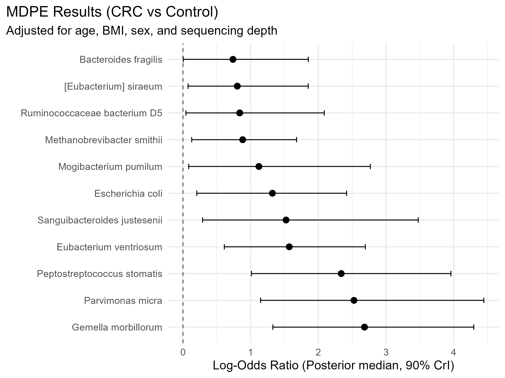

## MDPE: Multilevel Differential Prevalence Estimator

MDPE is a Bayesian hierarchical model designed for differential prevalence analysis in microbiome studies. It utilizes an asymmetric Laplace prior for the differential prevalence parameters. This choice is  motivated by a natural assumption that for most taxa in most studies the true differential prevalence effects are likely close to zero, and the observation that typically, within a given microbiome study, most of the non-zero prevalence differences have the same direction.

Unlike standard frequentist approaches (based on e.g., the Wald test), which may fail or yield infinite estimates in boundary cases (i.e., when a taxon is completely absent in one group), MDPE produces robust, finite estimates through Bayesian regularization. Furthermore, the model provides differential prevalence estimates and uncertainty intervals that are **inherently adjusted for multiplicity**.

This repository contains (not yet...) the code and datasets used to reproduce the analyses and figures presented in the manuscript introducing MDPE...

## Example analysis with MDPE

The following R code demonstrates how to apply MDPE to a real microbiome dataset (Thomas et al., 2019). The example study compares subjects with colorectal cancer (N = 31) and helathy subjects (N = 29).

Here, we use MDPE to estimate the differential prevalence of species between CRC cases and healthy controls while adjusting for age, BMI, sex, and sequencing depth.

### Prerequisites

Ensure you have the necessary packages installed. You may need Bioconductor for the data packages:
```
if (!require("BiocManager", quietly = TRUE))
    install.packages("BiocManager")

BiocManager::install(c("curatedMetagenomicData", "mia"))
install.packages(c("tidyverse", "rstan"))
```

### Load libraries and configure Stan

```
library(tidyverse)
library(curatedMetagenomicData)
library(mia)
library(rstan)

# Configure Stan
options(mc.cores = parallel::detectCores())
rstan_options(auto_write = TRUE)
```

### Prepare data
```
# Fetch dataset "ThomasAM_2018b". The code belowe returns (estimated) counts
# even though the assay name is "relative_abundance".
tse <- sampleMetadata |> 
  filter(study_name == "ThomasAM_2018b") |> 
  returnSamples(dataType = "relative_abundance",
                counts = TRUE,
                rownames = "long")


# Calculate Sequencing Depth (Total reads per sample)
tse$total_reads <- colSums(assay(tse, "relative_abundance"))

# Filter Taxa by Prevalence
# Keep taxa present in at least 4 samples
prevalence_limit <- 4 / ncol(tse) - 0.00001
tse <- subsetByPrevalent(tse,
                         assay_name = "relative_abundance",
                         rank = "species",
                         prevalence = prevalence_limit)

# Transform to Presence/Absence (Binary)
tse <- tse |> transformAssay(assay.type = "relative_abundance",
                             method = "pa")

# Extract the binary matrix (Taxa x Samples) for Stan
pa_matrix <- assay(tse, "pa") 

# Prepare metadata
meta <- colData(tse) |> 
  as.data.frame() |>
  mutate(
    # Binary Group: Control=0, Case=1
    group_bin = case_when(
      study_condition == "control" ~ 0,
      study_condition == "CRC" ~ 1
    ),
    
    # Continuous covariates: Standardize (mean=0, sd=1) and impute NAs
    age_scaled = as.numeric(scale(age)),
    age_scaled = ifelse(is.na(age_scaled), 0, age_scaled),
    
    bmi_scaled = as.numeric(scale(BMI)),
    bmi_scaled = ifelse(is.na(bmi_scaled), 0, bmi_scaled),
    
    # Binary Covariate: Sex (Female=0, Male=1)
    sex_bin = case_when(
      gender == "female" ~ 0,
      gender == "male" ~ 1
    ),
    
    # Sequencing depth: Log10 transformed and centered
    log_reads_centered = as.numeric(scale(log10(total_reads),
                                      center = TRUE,
                                      scale = FALSE))
  ) |> 
  select(group_bin, age_scaled, bmi_scaled, sex_bin, log_reads_centered)
```

### Stan code for the MDPE model
```
stan_code <- "
data {
  int <lower=0> N;                // Number of samples
  int <lower=0> K;                // Number of taxa
  int <lower=0, upper=1> y[K, N]; // Presence/absence matrix (Taxa x Samples)
  
  // Predictors
  vector[N] group;                // Group of interest (Case=1, Control=0)
  vector[N] reads;                // Sequencing depth (log10 - centered)
  vector[N] age;                  // Covariate: Age (scaled)
  vector[N] bmi;                  // Covariate: BMI (scaled)
  vector[N] sex;                  // Covariate: Sex (binary)
}

parameters {
  // Taxon-specific intercepts
  vector[K] alpha;
  
  // Coefficients for sequencing depth
  vector[K] beta_reads;
  
  // Coefficients for covariates
  vector[K] beta_age;
  vector[K] beta_bmi;
  vector[K] beta_sex;

  // Hierarchical parameters for the group effect (Asymmetric Laplace)
  vector[K] z;                    // Unscaled group effects
  real <lower=0, upper=1> nu;     // Skewness of the prior
  real <lower=0> tau;             // Scale (width) of the prior
}

transformed parameters {
  vector[K] beta;                 // Actual differential prevalence estimates
  beta = z .* tau;                // Scale the effects
}

model {
  // --- Priors ---
  
  // Weakly informative priors for intercepts and read depth effect
  alpha ~ normal(0, 5);
  beta_reads ~ normal(2, 2);
  
  // Standard Normal priors for confounders
  beta_age ~ normal(0, 1);
  beta_bmi ~ normal(0, 1);
  beta_sex ~ normal(0, 1);
  
  // Hierarchical Asymmetric Laplace prior for the group effect
  // nu controls skewness (centered at 0.5 = symmetric)
  // tau controls shrinkage (global scale)
  nu ~ double_exponential(0.5, 0.05);
  tau ~ normal(0, 1);
  z ~ skew_double_exponential(0, 1, nu); 

  // --- Likelihood ---
  for (k in 1:K) {
    // Logistic regression with all covariates
    y[k] ~ bernoulli_logit(
      alpha[k] + 
      group * beta[k] + 
      reads * beta_reads[k] + 
      age * beta_age[k] + 
      bmi * beta_bmi[k] + 
      sex * beta_sex[k]
    );
  }
}
"
```

### Run the MDPE model
```
# Create the data list for Stan
stan_data_list <- list(
  N = ncol(pa_matrix),
  K = nrow(pa_matrix),
  y = as.matrix(pa_matrix),
  group = meta$group_bin,
  reads = meta$log_reads_centered,
  age   = meta$age_scaled,
  bmi   = meta$bmi_scaled,
  sex   = meta$sex_bin
)

# Posterior sampling (This may take several minutes to run!)
# Note: The number of iterations (200/400) and chains (2) are chosen here for
# demonstration purposes only. For real analyses, consider using more iterations
# and chains (e.g. 1000/3000 iterations and 4 chains).
fit <- stan(
  model_code = stan_code,
  data = stan_data_list,
  chains = 2,
  iter = 400,
  warmup = 200,
  seed = 1,
  refresh = 200 # Print progress every 200 iterations
)
```

### Extract and illustrate the results
```
# Extract posterior samples for differential prevalence parameters (beta)
posterior_beta <- extract(fit)$beta

# Calculate posterior estimates and 90% credible intervals
results <- tibble(
  taxon = rownames(pa_matrix),
  est = apply(posterior_beta, 2, median),
  lower_90 = apply(posterior_beta, 2, quantile, probs = 0.05),
  upper_90 = apply(posterior_beta, 2, quantile, probs = 0.95)
) |>
  # Identify significant taxa (90% CrI excludes zero)
  mutate(significant = lower_90 > 0 | upper_90 < 0)

# Show significant findings
results |> filter(significant) |> arrange(est)


# Simple visualization of the results for significant taxa
ggplot(results |> filter(significant),
       aes(x = reorder(taxon, -est), y = est)) +
  geom_point(size = 3) +
  geom_errorbar(aes(ymin = lower_90, ymax = upper_90), width = 0.2) +
  geom_hline(yintercept = 0, linetype = "dashed", color = "gray30") +
  coord_flip() +
  labs(
    title = "MDPE Results (CRC vs Control)",
    subtitle = "Adjusted for age, BMI, sex, and sequencing depth",
    y = "Log-Odds Ratio (Posterior median, 90% CrI)",
    x = ""
  ) +
  theme_minimal(base_size = 14) +
  theme(plot.title.position = "plot")
```

<p align="left">
  
</p>

## References

**Thomas, A.M. et al.** Metagenomic analysis of colorectal cancer datasets identifies cross-cohort microbial diagnostic signatures and a link with choline degradation. Nat Med 25, 667–678 (2019). https://doi.org/10.1038/s41591-019-0405-7
