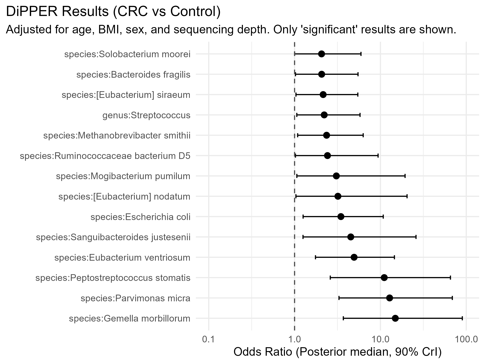

## DiPPER - Differential Prevalence via Probabilistic Estimation in R

DiPPER is a Bayesian hierarchical model designed for differential prevalence analysis in microbiome studies. Unlike standard frequentist approaches (based on e.g., the Wald test), which may fail or yield infinite estimates in boundary cases (i.e., when a taxon is completely absent in one group), DiPPER produces robust, finite estimates through Bayesian regularization. Furthermore, the model provides differential prevalence estimates and uncertainty intervals that are inherently adjusted for multiplicity.

Technically, DiPPER utilizes a common asymmetric Laplace prior (whose variance and skewness are determined by the data) for the differential prevalence parameters. This choice is  motivated by a natural assumption that for most taxa in most studies the true differential prevalence effects are likely close to zero, and the observation that typically, within a given microbiome study, most of the non-zero prevalence differences have the same direction.

This repository contains the code and datasets (located in the R folder) for reproducing the analyses and figures in the paper introducing DiPPER (see a pre-print [here](https://arxiv.org/abs/2602.05938)).


## Example analysis with DiPPER (Updated March 11, 2026)

The following R code demonstrates how to apply DiPPER to a real microbiome dataset (Thomas et al., 2019). The example study compares subjects with colorectal cancer (CRC, N = 31) and helathy subjects (N = 29).

Here, we use DiPPER to estimate the differential prevalence of species between CRC cases and healthy controls while adjusting for age, BMI, sex, and sequencing depth.

### Prerequisites

Ensure you have the necessary packages installed.
```
if (!require("BiocManager", quietly = TRUE))
    install.packages("BiocManager")

BiocManager::install(c("curatedMetagenomicData", "mia"))

# Install cmdstanr and posterior
install.packages("cmdstanr", repos = c("https://mc-stan.org/r-packages/", getOption("repos")))
install.packages(c("tidyverse", "posterior"))

# Note: cmdstanr requires CmdStan to be installed under the hood. 
# Run cmdstanr::install_cmdstan() if you haven't installed it yet.


# Load tidyverse and cmdstanr
library(tidyverse)
library(cmdstanr)
```


### Prepare data
```
# Fetch dataset "ThomasAM_2018b" as a TreeSummarizedExperiment (TSE) object.
tse <- curatedMetagenomicData::sampleMetadata |> 
  filter(study_name == "ThomasAM_2018b") |> 
    curatedMetagenomicData::returnSamples(
    dataType = "relative_abundance",
    counts = TRUE, # Returns (estimated) counts
    rownames = "short"
  )

# Transform counts to presence/absence
tse <- mia::transformAssay(tse, 
                           assay.type = "relative_abundance", 
                           method = "pa")

# Calculate Sequencing Depth (Total reads per sample)
tse$total_reads <- colSums(SummarizedExperiment::assay(tse, "relative_abundance"))

# Keep taxa with at least 5 presences AND at least 5 absences
n_samples <- ncol(tse)
prevalences <- mia::getPrevalence(tse, assay.type = "pa", as_relative = FALSE)
presences <- round(n_samples * prevalences)
tse <- tse[presences >= 5 & presences <= (n_samples - 5), ]

# Extract the final presence/absence matrix
pa_matrix <- SummarizedExperiment::assay(tse, "pa")

# Extract and prepare metadata.
meta <- SummarizedExperiment::colData(tse) |> 
  as.data.frame() |>
  mutate(
    # Study group(Control = 0, CRC = 1): Create a binary variable and center
    group = case_when(study_condition == "control" ~ 0,
                      study_condition == "CRC" ~ 1),
    group = as.numeric(scale(group, scale = FALSE)),
    
    # Sequencing depth: Log10 transform and center
    log_reads_centered = as.numeric(scale(log10(total_reads), scale = FALSE)),
    
    # Age and BMI: Standardize (center and scale) and impute missing values
    age = as.numeric(scale(age)),
    age = ifelse(is.na(age), 0, age),
    
    bmi = as.numeric(scale(BMI)),
    bmi = ifelse(is.na(bmi), 0, bmi),
    
    # Sex (female = 0, male = 1): Create a binary variable and center
    sex = case_when(gender == "female" ~ 0,
                    gender == "male" ~ 1),
    sex = as.numeric(scale(sex, scale = FALSE))
  ) |> 
  select(group, log_reads_centered, age, bmi, sex)


# Prepare data for Stan

# Create the design matrix. 
# Note: Column 1 MUST be the variable of interest (here Control/CRC group)!
# Note 2: Column 2 must be the log_reads_centered variable.
X_design <- cbind(
  group = meta$group,
  reads = meta$log_reads_centered,
  age   = meta$age,
  bmi   = meta$bmi,
  sex   = meta$sex
)

# Create the final data list to be passed to Stan
stan_data_list <- list(
  N = ncol(pa_matrix),
  K = nrow(pa_matrix),
  P = ncol(X_design),
  y = as.matrix(pa_matrix),
  X = X_design
)
  
```

### Stan code for DiPPER
```
stan_code <- "
data {
  int<lower=0> N;                                // Number of samples
  int<lower=0> K;                                // Number of taxa
  int<lower=0> P;                                // Number of predictors
  array[K, N] int<lower=0, upper=1> y;           // Presence/absence matrix
  matrix[N, P] X;                                // Design matrix
}

parameters {
  vector[K] alpha;                               // Taxon-specific intercepts
  matrix[P - 1, K] beta_cov;                     // Coefficients for covariates

  // Parameters for the Asymmetric Laplace prior
  vector[K] z_norm;
  vector<lower=0>[K] z_exp;
  real<lower=0, upper=1> nu; 
  real<lower=0> tau;
}

transformed parameters {
  vector[K] z;
  vector[K] beta;                          // Differential prevalence estimates
  matrix[P, K] B;

  real theta = (1.0 - 2.0 * nu) / (nu * (1.0 - nu));
  real tau_sq = 2.0 / (nu * (1.0 - nu));
  
  for (k in 1:K) {
    z[k] = theta * z_exp[k] + sqrt(tau_sq * z_exp[k] + 1e-8) * z_norm[k];
  }
  
  beta = z * tau;            
  
  B[1, ] = beta';        
  if (P > 1) {
    B[2:P, ] = beta_cov;
  }
}

model {
  // --- Priors ---
  alpha ~ normal(0, 4); 
  
  // Assign specific prior to reads (first covariate, row 1 of beta_cov) 
  // and standard normal to the rest of the covariates
  if (P > 1) {
    beta_cov[1] ~ normal(2, 2); 
  }
  if (P > 2) {
    for (i in 2:(P - 1)) {
      beta_cov[i] ~ normal(0, 1);
    }
  }
  
  // Hyperparameters
  nu ~ double_exponential(0.5, 0.05);    
  tau ~ normal(0, 1);
  
  // Latent variables for the Asymmetric Laplace 
  z_norm ~ std_normal();
  z_exp ~ exponential(1.0); 

  // --- Likelihood ---
  for (k in 1:K) {
    y[k] ~ bernoulli_logit_glm(X, alpha[k], B[, k]);
  }
}
"
```

### Run DiPPER
```
# Compile the Stan model
# This creates a compiled model object in your project folder. This may take
# around 30 s to 1 min. But this needs to be done only once (in the same folder)!
# Note: The compilation process will print several lines of C++ compiler messages 
# and warnings to your console. These can be safely ignored, however.
mod <- cmdstan_model(write_stan_file(stan_code, dir = "."))

# Define the initialization function to provide reasonable starting values for
# the parameters.
init_fun <- function() {
  list(
    alpha = rep(-1, stan_data_list$K),
    beta_cov = matrix(0, nrow = stan_data_list$P - 1, ncol = stan_data_list$K),
    z_norm = rep(0, stan_data_list$K),
    z_exp = rep(1, stan_data_list$K),
    nu = 0.5,
    tau = 0.1
  )
}

# Run posterior sampling
# This should take less than 2 minutes on a standard laptop.
# Note: 500 - 1000 warmup and sampling iterations per chain are typically
# sufficient for convergence for DiPPER.
# Note 2: The printed messages "The current Metropolis proposal..." or
# "Exception: bernoulli_logit_glm_lpmf: Weight vector[1] is ..." can be
# ignored.
fit <- mod$sample(
  data = stan_data_list,
  seed = 1,
  chains = 4,            # Number of Markov chains
  parallel_chains = 4,   # Use 4 here if you have at least 4 CPU cores available
  init = init_fun,
  iter_warmup = 700,     # Number of warmup iterations (per chain)
  iter_sampling = 700,   # Number of sampling iterations (per chain)
  adapt_delta = 0.8,
  max_treedepth = 10
)
```

### Extract and illustrate the results
```
# First, check convergence diagnostics
# A properly converged model should have a maximum R-hat < 1.01 and minimum
# Effective Sample Size (ESS bulk and tail) > 400. There should also be no 
# divergent transitions (check the cmdstanr output for this).
# In case those criteria are not met, consider increasing the number of
# iterations.
diagnostics <- fit$summary()

max(diagnostics$rhat, na.rm = TRUE) # Maximum R-hat (should be < 1.01)
min(diagnostics$ess_bulk, na.rm = TRUE) # Minimum ESS bulk (should be > 400)
min(diagnostics$ess_tail, na.rm = TRUE) # Minimum ESS tail (should be > 400)


# Extract posterior samples for differential prevalence parameters (beta)
# and calculate medians and 90% posterior (credible) intervals
results <- fit$summary(
  variables = "beta",
  est = ~ median(.x),
  lower_90 = ~ quantile(.x, probs = 0.05),
  upper_90 = ~ quantile(.x, probs = 0.95)
) |>
  dplyr::rename(taxon = 1, est = 2, lower_90 = 3, upper_90 = 4) |> 
  mutate(
    # Attach taxon names from the original presence/absence matrix
    taxon = rownames(pa_matrix),
    
    # Identify "significant" taxa (90% posterior interval excludes zero)
    significant = lower_90 > 0 | upper_90 < 0
  ) |>
  select(taxon, est, lower_90, upper_90, significant)

# Show "significant" findings
results |> 
  filter(significant) |> 
  arrange(est)

# Simple visualization of the results for significant taxa
# Posotive estimates (est > 0) indicate higher prevalence in CRC group
ggplot(results |> filter(significant),
       aes(x = reorder(taxon, -est), y = exp(est))) +
  geom_point(size = 3) +
  geom_errorbar(aes(ymin = exp(lower_90), ymax = exp(upper_90)), width = 0.2) +
  geom_hline(yintercept = 1, linetype = "dashed", color = "gray30") +
  scale_y_log10(limits = c(0.1, 100)) +
  coord_flip() +
  labs(
    title = "DiPPER Results (CRC vs Control)",
    subtitle = "Adjusted for age, BMI, sex, and sequencing depth",
    y = "Odds Ratio (Posterior median, 90% CrI)",
    x = ""
  ) +
  theme_minimal(base_size = 14) +
  theme(plot.title.position = "plot")
```

<p align="left">
  
</p>

### References

Thomas, A.M. et al. Metagenomic analysis of colorectal cancer datasets identifies cross-cohort microbial diagnostic signatures and a link with choline degradation. Nat Med 25, 667–678 (2019). https://doi.org/10.1038/s41591-019-0405-7
